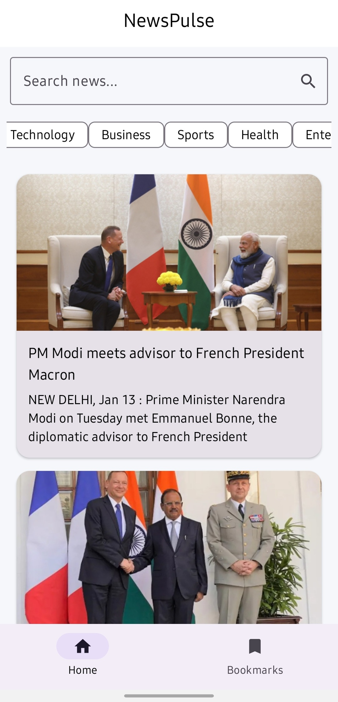
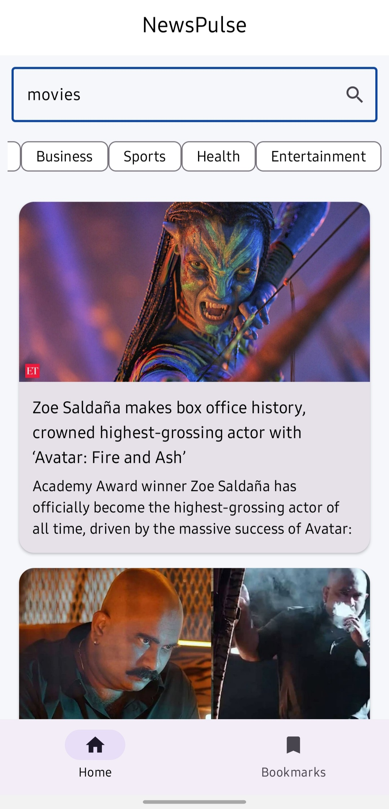
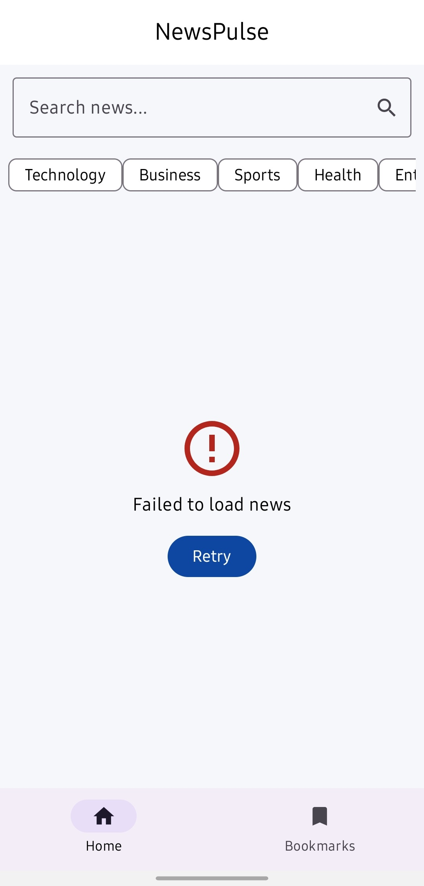
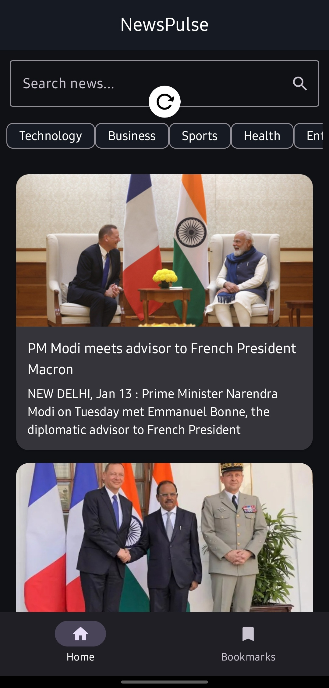
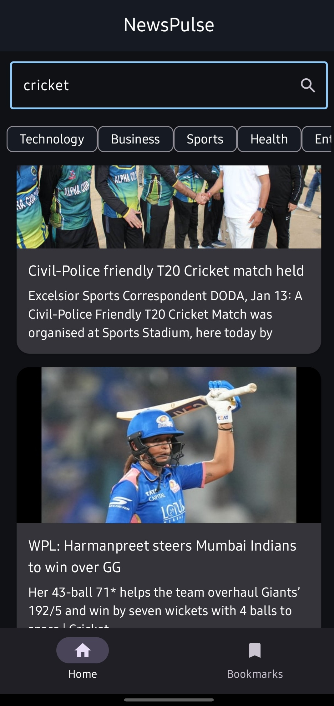
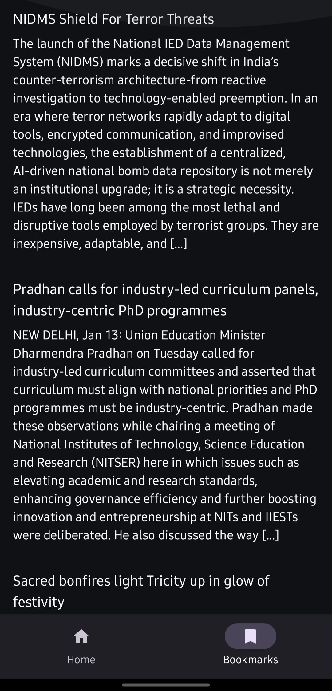
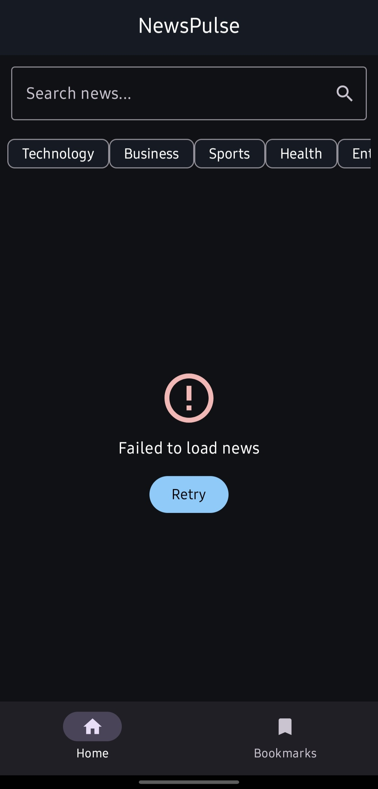

# 📰 NewsPulse – News App with Jetpack Compose

Welcome to **NewsPulse**!  
NewsPulse is a modern Android news application built using **Jetpack Compose** and **Material 3**, following **MVVM architecture** and the **Repository pattern**.  
The app focuses on clean architecture, state-driven UI, and local data persistence using **Room Database**.

This project is designed as a **learning-focused yet professional Android application**, but scoped for clarity, explainability, and strong backend fundamentals.

---

## 📸 Screenshots

### ☀️ Light Mode

| Home                                      | Search                                        | Detail                                        | Bookmarks                                          | Error                                       |
|-------------------------------------------|-----------------------------------------------|-----------------------------------------------|----------------------------------------------------|---------------------------------------------|
|  |  |  |  |  |

---

### 🌙 Dark Mode

| Home                                    | Search                                      | Detail                                      | Bookmarks                                        | Error                                     |
|-----------------------------------------|---------------------------------------------|---------------------------------------------|--------------------------------------------------|-------------------------------------------|
|  |  |  |  |  |


---

## ✨ Features

- 🧱 MVVM Architecture with Repository Pattern
- ⚛️ Jetpack Compose UI
- 🎨 Material 3 Design System
- 🌙 Light & Dark Mode (System-based)
- 📰 Fetches news from a remote API
- 🔍 Search news articles using keywords
- 🗂 Category-based news filtering
- ⏳ Loading placeholders
- ⚠️ Error & Empty state handling
- 🎬 Animated list items and UI transitions
- 🔄 Pull-to-refresh functionality
- 📌 Bookmark news articles
- 💾 Local data persistence using Room Database
- 🧭 Navigation Compose with safe data passing
- 📱 Tested on real Android device

---

## 🛠️ Technologies Used

- **Language:** Kotlin
- **UI Toolkit:** Jetpack Compose
- **Design:** Material 3
- **Architecture:** MVVM + Repository
- **State Management:** StateFlow
- **Navigation:** Navigation Compose
- **Local Database:** Room
- **Image Loading:** Coil
- **Version Control:** Git & GitHub

---

## 🧠 Architecture Overview

UI (Compose Screens)-->
ViewModel (StateFlow)-->
Repository-->
Remote API / Room Database


---

## 📌 Bookmark Feature

NewsPulse allows users to **bookmark news articles**, which are stored locally using **Room Database**.

- Bookmarked articles persist across app restarts
- Bookmark screen displays saved articles
- Demonstrates local persistence and database usage

---

## 🔐 API Configuration (Note)

For simplicity, API configuration is currently handled within the project.  
Similar to applications like *MovieHouse*, this can be enhanced in the future by moving the API key to `local.properties` and injecting it via `BuildConfig` for improved security.

---

## 🚀 How to Run

1. Clone the repository
   ```bash
   git clone https://github.com/PranavDhere45/NewsPulse.git
2. Open the project in Android Studio

3. Sync Gradle files

4. Run the app on an emulator or physical Android device